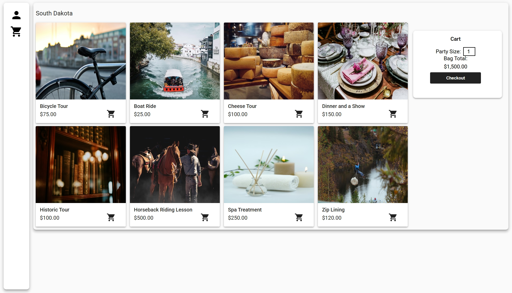
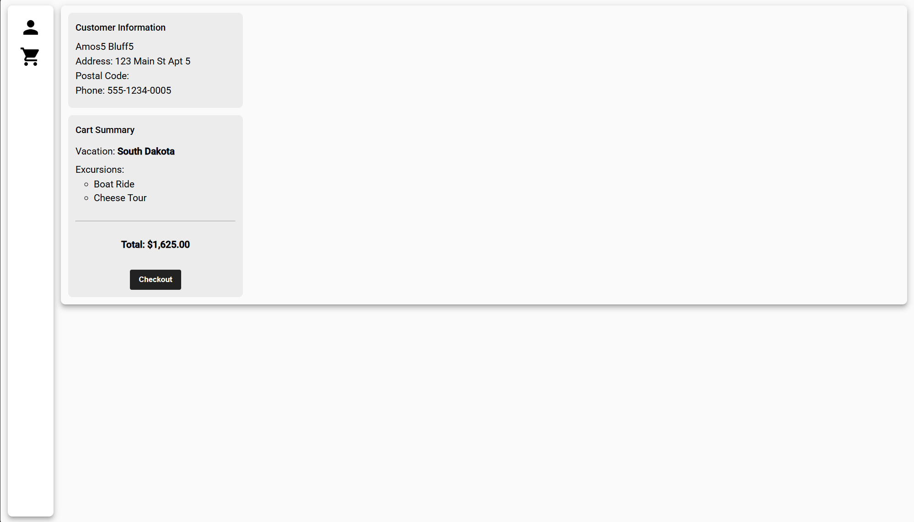
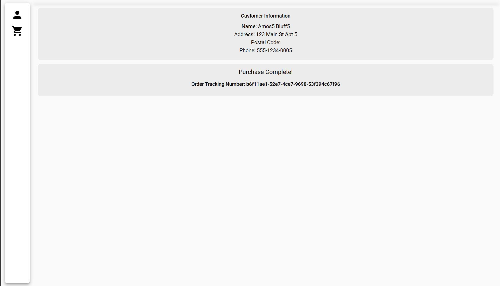

# Vacation & Excursion Shopping App

This is an application that consists of a Spring Boot backend and an Angular frontend.

It utilizes a MySQL database to store information about vacations and excursions, allowing users to browse, search, and book their desired trips.

## Screenhots





## Features
- Browse a wide range of vacations and excursions
- Book excursions directly through the app
- User management

## Technologies Used
- Spring Boot
- Angular
- MySQL
- RESTful APIs
- Hibernate/JPA

## Getting Started

### Backend
1. Navigate to the `backend` directory:
   ```bash
   cd backend
   ```
2. Install the dependencies using Maven:
3. ```bash
   mvn clean install
   ```
4. Configure the database connection in `src/main/resources/application.properties`:
5. ```properties
   spring.datasource.url=jdbc:mysql://localhost:3306/your_database
   spring.datasource.username=your_username
   spring.datasource.password=your_password
   ```
6. Start the Spring Boot application:
7. ```bash
    mvn spring-boot:run
    ```
### Database Setup
1. Ensure you have MySQL installed and running.
2. Run init-db.sql located in the `database` directory to create the necessary database and tables.
3. ```bash
   mysql -u your_username -p < database/init-db.sql
   ```

### Frontend
1. Navigate to the `frontend` directory:
   ```bash
   cd frontend
   ```
2. Install the dependencies:
3. ```bash
   npm install
   ```
4. Start the Angular development server:
5. ```bash
   ng serve
   ```
6. Open your browser and go to `http://localhost:4200`

